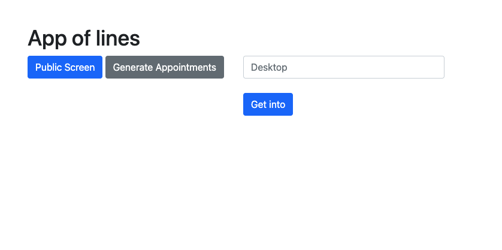
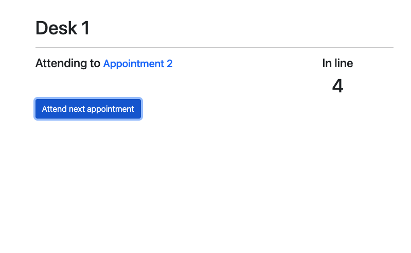
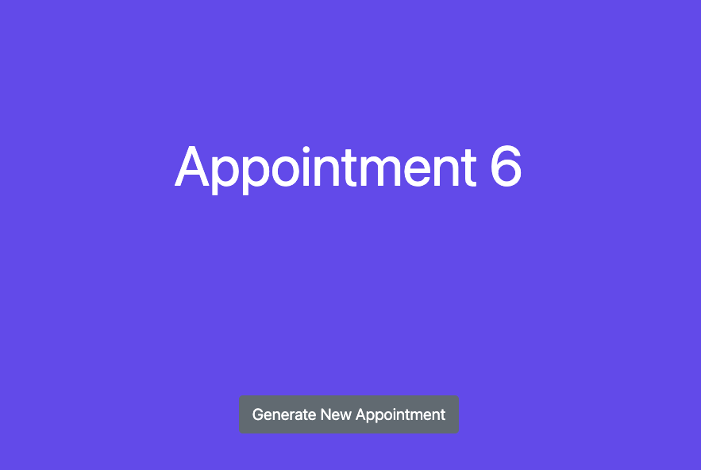
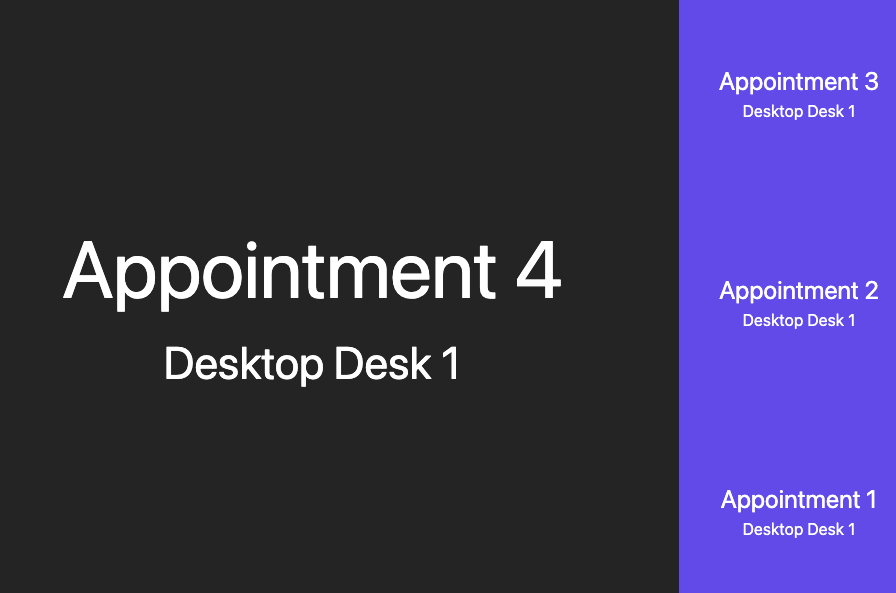

# Websocket Server

A Web Socket Server for appointments in `node.js`

## Description

A Websocket Server in `node.js` that uses `express` and `socket.io`.
In this app I use different methods to communicate the client and the server using web sockets with `socket.io`.

## Getting Started

### Dependencies

- `npm`
- `node`

### Installing

- Clone the repository and install dependencies:

```
git clone https://github.com/Felipe-Navas/websocket-server-appointments-system.git && cd websocket-server-appointments-system && npm install
```

- Create a `.env` file in the root of the project and configure the `PORT` variable

### Executing program

```
npm start
```

Preview of the principal page:



Preview of the screen of desktop:



Preview of the screen of new appointment:



Preview of the public screen:



### Running tests

```
npm test
```

## Authors

- [Felipe Navas](https://www.linkedin.com/in/felipenavaslederhos) - [Email](mailto:felipenavas.itec@gmail.com?subject=[GitHub]%20websocket-server-appointments-system)

## Contributing

1. Fork it (<https://github.com/Felipe-Navas/websocket-server-appointments-system/fork>)
2. Create your feature branch (`git checkout -b feature/fooBar`)
3. Commit your changes (`git commit -am 'Add some fooBar'`)
4. Push to the branch (`git push origin feature/fooBar`)
5. Create a new Pull Request

## License

This project is licensed under the [MIT License] - see the LICENSE file for details
